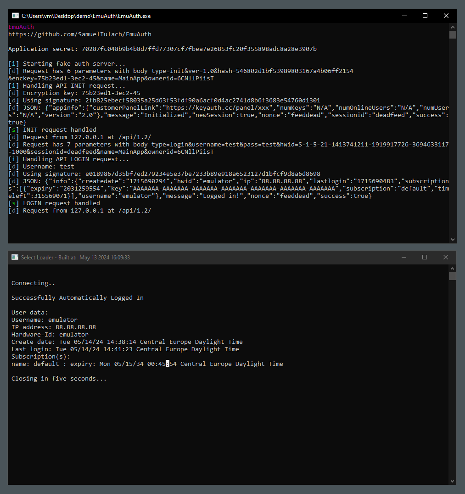
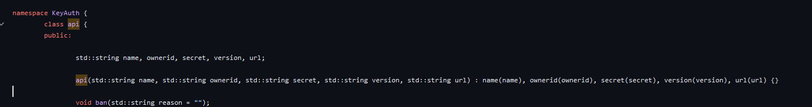
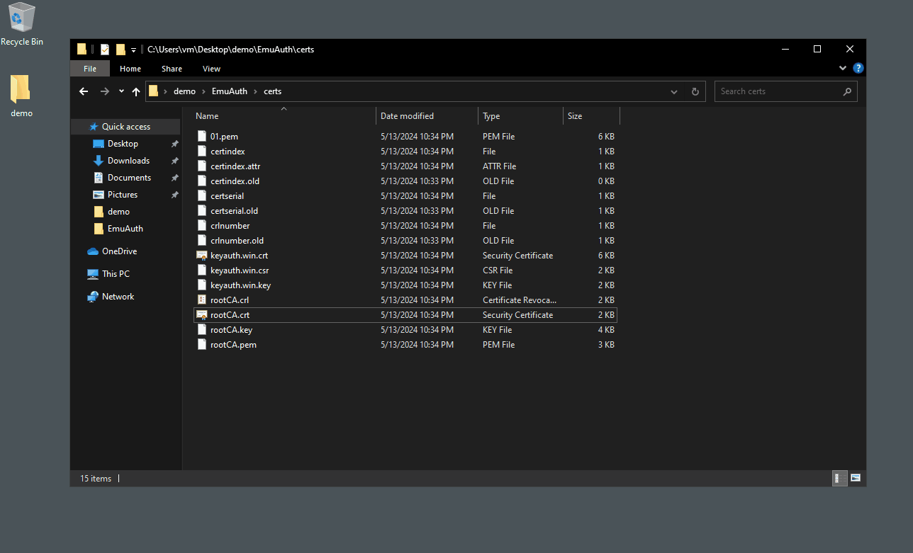

# EmuAuth
This project is a simple reimplementation of the [KeyAuth](https://keyauth.cc/) protocol for purposes of its emulation. 



## Usage
### Step 1: Obtain application secret
The server emulator cannot work unless you have the correct application secret used by the application. For example, the C++ library reads the provided secret and saves it in a class using the std::string container. In other words, it’s not protected in any way and is visible at all times in memory. All you have to do is simply dump the secret from the program while it’s running using something like [Process Hacker](https://processhacker.sourceforge.io/).



If the program is more advanced, the secret might not be visible at all times. In that case, you can use the InternalHelper DLL, inject it before the program's entry is even executed, and the program will then show a message box (pausing until you close it) when the function UuidCreate is called.

**Tip:** When searching for the application secret in Process Hacker, you can use regex `^[a-zA-Z0-9]{64}$` to show only strings that match with the secret format.

### Step 2: Run the emulator
Before you can use the emulator, you need to do two things:

**Add the generated root CA certificate to trusted root certificates**
1. Double-click on `rootCA.crt`
2. Click "Install certificate"
3. Select "Local Machine," then click "Next"
4. Select "Place all certificates in the following store," click "Browse" and select "Trusted Root Certification Authorities"
5. Click "Finish"



**Redirect API URLs to localhost using hosts file**
1. Open `C:\Windows\System32\drivers\etc\hosts`
2. Add the following line:
```
127.0.0.1 keyauth.win
```
3. Save the file

Once that is done, open `EmuAuth.exe` and enter the application secret. All traffic to KeyAuth servers should now be redirected to it. You might need to recompile it and edit/add some other responses depending on the target program.

[](https://www.youtube.com/watch?v=VFNzedvtjJs)